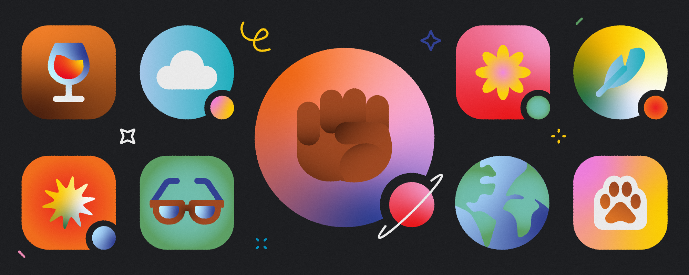

<!-- Intro Section -->
<h1 align="center"> Hello World,  I'm Mireya Elisse </h1>

<!-- About Me Section -->
<h2> 🐾 About Me 😼 </h2>

<em> I am currently graphic Web and Design enthusiast focusing on the tools used in front end development such as **HTML5**, **CSS3**, and **JAVASCRIPT**. </em>

<!-- Social Media Section -->

<h3 align="left"> 👇 Reach out to me! 📫 </h3>
 

&nbsp;&nbsp;&nbsp;

<h3 align+"left"> 🛠️ Languages and Tools: </h3>

&nbsp;&nbsp;&nbsp;&nbsp;&nbsp;&nbsp;&nbsp;&nbsp;
&nbsp;&nbsp;&nbsp;
 

_<h4 align="left">Profile Visits Counter<h4>_

